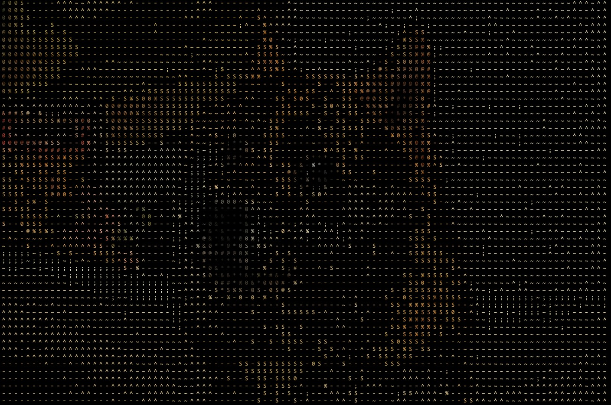
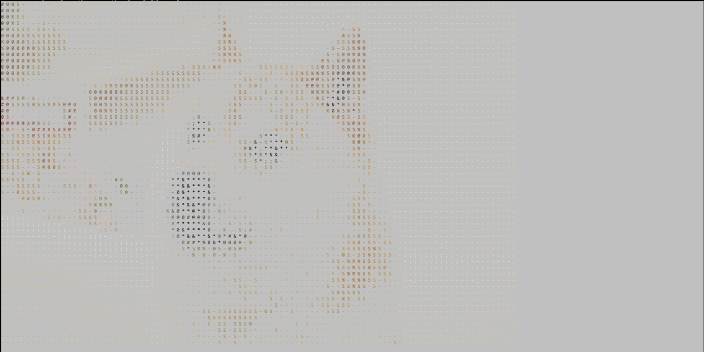

# PyAscii
Simple, functional-style, CLI utility for turning images into colourful ASCII art

# Usage
Install all the dependencies in the requirements.txt file using 
'''
pip install -r requirements.txt
'''

then, navigate to the PyAscii folder and simply run
```
main.py IMAGE_PATH
```
Where IMAGE_PATH directs to an absolute or relative location of an image. 


# Additional arguments
```--kernel [int] <-- the size of the kernel used for processing the image (i.e., 3 = 3*3, 5 = 5*5, etc.)
--no-color <-- disable coloring and just show pure ASCII
--randomize <-- randomize the ascii characters used for each run
--background <-- adds a white background to the result
```

# Examples:
Here's a colorful, yellow-centeric, doge example:

 

Here's the example with a white background:


Here's a dark kitty:
 

# Note

- Currently only tested on MacOS but it should serve fine on other OSs.
- Inspired partly by the following module:
https://www.hackerearth.com/practice/notes/beautiful-python-a-simple-ascii-art-generator-from-images/
